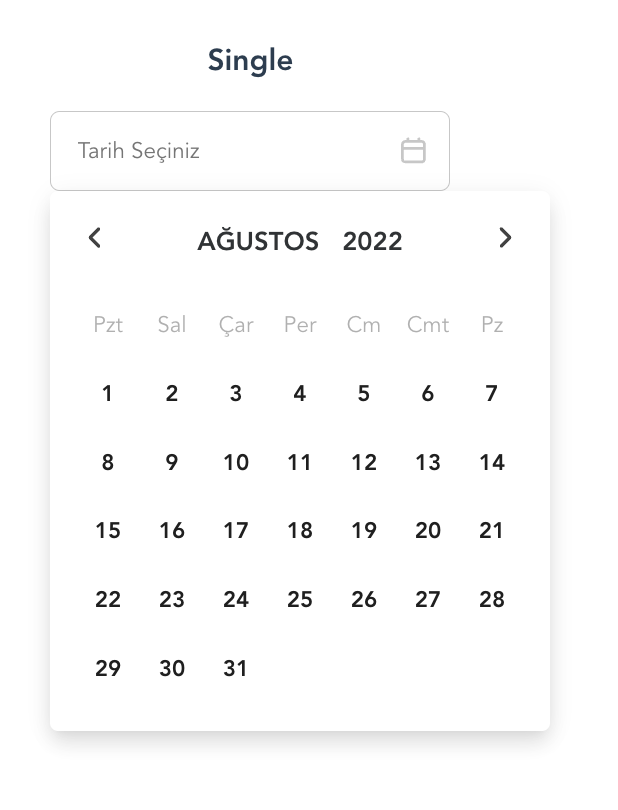
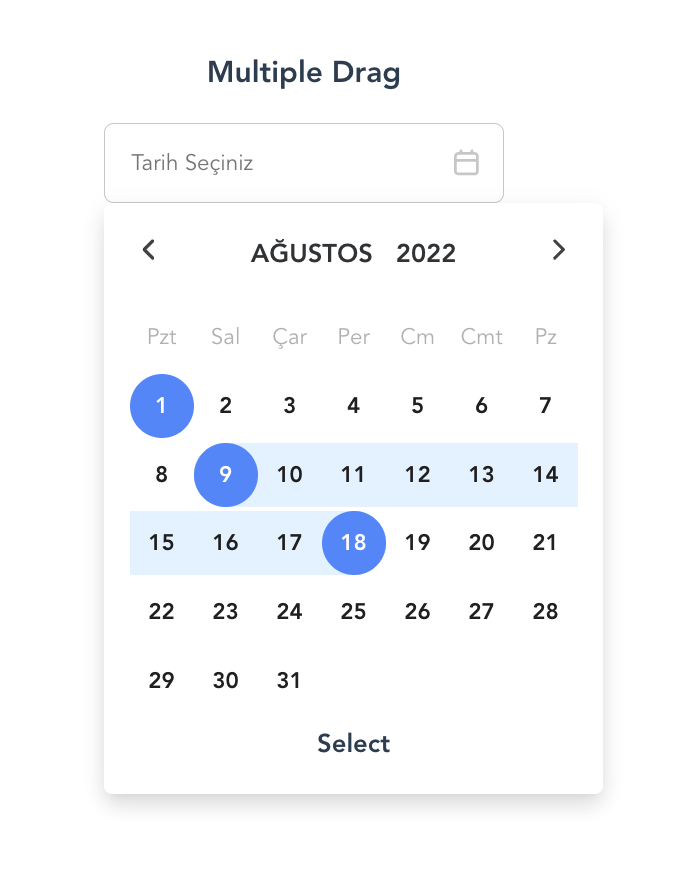
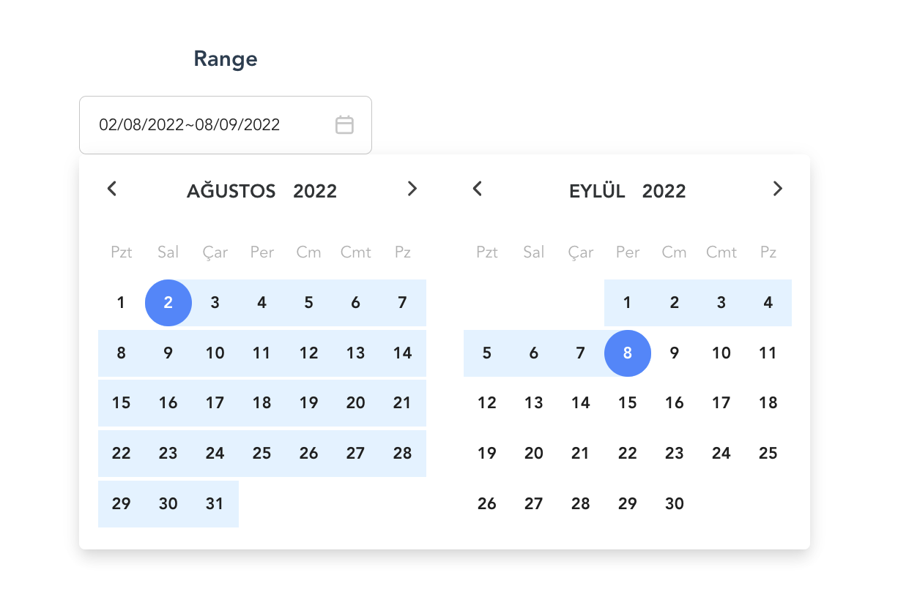

# Vue Multiple Datepicker



<hr>

<hr>


### Using

**Installing**

```bash
npm install vue-m-datepicker
```

**Import to Project**

```javascript
// main.js file
import DatePicker from 'vue-m-datepicker';
Vue.component('Datepicker', DatePicker)
```


```vue
<script>
  import Datepicker from 'vue-m-datepicker';
  export default {
    components: {
      Datepicker
    }
  }
</script>
```
and

### Props
``` html
   <Datepicker 
        range: Boolean,
        multipleDrag: Boolean,
        maxDate: [String, Number, Date],
        minDate: [String, Number, Date],
        disable: Boolean,
        title: String
   />
```

### Customize configuration
See [Configuration Reference](https://cli.vuejs.org/config/).
